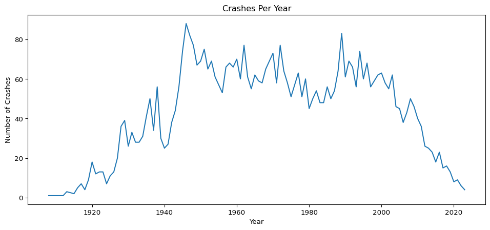
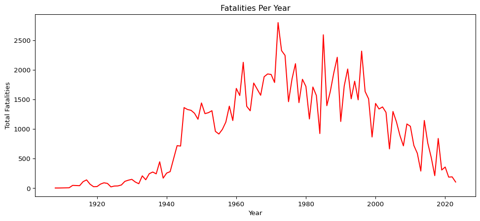
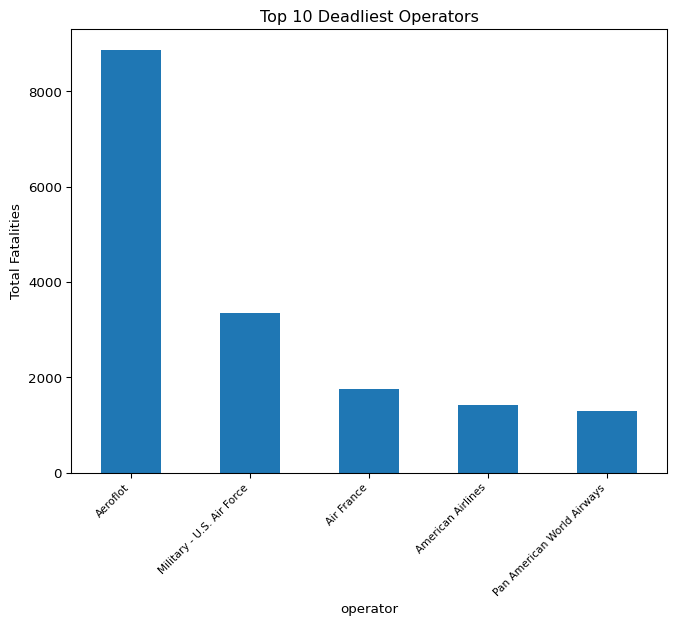

# Airplane Tragedies


``` python
import pandas as pd
import statsmodels.api as sm
import matplotlib.pyplot as plt
import matplotlib.pyplot as plt
data = pd.read_csv("c:/Users/herbe/Documents/Wrangling-Project/Airplane_Crashes_and_Fatalities_Since_1908_t0_2023.csv", encoding='latin-1')
```

# I inspected the dataset’s columns, basic statistics, and data types.There are issues such as inconsistent formatting, missing values, and incorrect data types that need cleaning. Understanding the structure and quality of the data helps identify what needs cleaning before meaningful analysis.

``` python
data.columns

data.describe(include='all')

data.info()
```

    <class 'pandas.core.frame.DataFrame'>
    RangeIndex: 4998 entries, 0 to 4997
    Data columns (total 17 columns):
     #   Column                 Non-Null Count  Dtype  
    ---  ------                 --------------  -----  
     0   Date                   4998 non-null   object 
     1   Time                   3486 non-null   object 
     2   Location               4994 non-null   object 
     3   Operator               4988 non-null   object 
     4   Flight #               1329 non-null   object 
     5   Route                  4221 non-null   object 
     6   AC Type                4983 non-null   object 
     7   Registration           4724 non-null   object 
     8   cn/ln                  4330 non-null   object 
     9   Aboard                 4980 non-null   float64
     10  Aboard Passangers      4769 non-null   float64
     11  Aboard Crew            4772 non-null   float64
     12  Fatalities             4990 non-null   float64
     13  Fatalities Passangers  4756 non-null   float64
     14  Fatalities Crew        4757 non-null   float64
     15  Ground                 4956 non-null   float64
     16  Summary                4934 non-null   object 
    dtypes: float64(7), object(10)
    memory usage: 663.9+ KB

# The Code below is trying to address the questions below.

# 1) How have plane crashes changed over time?

# 2) How have fatalities per year changed over time?

# 3) How deadly are crashes in terms of survival outcomes?

# 4) Which operators have caused the highest number of fatalities?

# 5) What are the overall characteristics of global plane crashes?

# Data Cleaning Process, several column names contained spaces and non-standard characters. Clean, standardized column names prevent errors and make coding easier.

``` python
data.columns = (data.columns.str.strip().str.lower().str.replace(' ', '_').str.replace('#', 'number').str.replace('/', '_'))
```

# After data cleaning, Some dates were invalid or missing, but most converted correctly. Accurate dates are needed to analyze crash trends over time

``` python
data['Date'] = pd.to_datetime(data['date'], errors='coerce')

data.columns
```

    Index(['date', 'time', 'location', 'operator', 'flight_number', 'route',
           'ac_type', 'registration', 'cn_ln', 'aboard', 'aboard_passangers',
           'aboard_crew', 'fatalities', 'fatalities_passangers', 'fatalities_crew',
           'ground', 'summary', 'Date'],
          dtype='object')

# Mathematical operations like totals and averages cannot be computed unless data is numeric thus we need to Convert categorical columns to numeric columns.

``` python
num_cols = [
    'aboard',
    'aboard_passangers',
    'aboard_crew',
    'fatalities',
    'fatalities_passangers',
    'fatalities_crew',
    'ground'
]


for col in num_cols: data[col] = pd.to_numeric(data[col], errors='coerce')
```

# Creating time based features because the dataset spans more than 100 years of aviation history

``` python
data['year'] = data['Date'].dt.year
data['month'] = data['Date'].dt.month
data['day_of_week'] = data['Date'].dt.day_name()
data['decade'] = (data['year'] // 10) * 10
```

# Below we create new columns.Many routes include both takeoff and landing points. This helps understand global crash distribution and flight patterns.

# Where were these planes going?

``` python
data[['origin', 'destination']] = data['route'].str.split('-', n=1, expand=True)
```

# Now we create Survival rate column

``` python
data['survival_rate'] = data['aboard'] - data['fatalities']
data.loc[data['aboard'] <=0, 'survival_rate'] = None
```

# Survival category

``` python
def classify(row):
    if pd.isna(row['survival_rate']):
        return "Unknown"
    if row['survival_rate'] == 0:
        return "No survivors"
    if row['survival_rate'] == 1:
        return "All survived"
    return "Some survived"

data['survival_category'] = data.apply(classify, axis=1)
```

# Computed summary statistics such as crashes per year, fatalities per year, operator totals, and survival categories. Certain decades show spikes, some operators have long histories of fatal accidents, and survival outcomes vary greatly. These metrics summarize the global crash landscape and form the foundation for deeper analysis.

``` python
crashes_per_year = data.groupby('year').size()

fatalities_per_year = data.groupby('year')['fatalities'].sum()

operator_counts = data['operator'].value_counts()

deadliest_operators = data.groupby('operator')['fatalities'].sum().sort_values(ascending=False)

data['fatalities_per_crash'] = data['fatalities']

survival_distribution = data['survival_category'].value_counts()
```

# VISUALIZATIONS

# a) Crashes Per Year

# From the figure we see fatalities follow a similar decline as crash counts but show spikes linked to major accidents.This reveals changes in aviation safety affecting human lives.

``` python
plt.figure(figsize=(12,5))
crashes_per_year.plot()
plt.title("Crashes Per Year")
plt.xlabel("Year")
plt.ylabel("Number of Crashes")
plt.show()
```



# b) Fatalities Per Year

# Fatalities follow a similar decline as crash counts but show spikes linked to major. This reveals changes in aviation safety affecting human lives.

``` python
plt.figure(figsize=(12,5))
fatalities_per_year.plot(color='red')
plt.title("Fatalities Per Year")
plt.xlabel("Year")
plt.ylabel("Total Fatalities")
plt.show()
```



# c) Survival Categories

# Visualized how crashes break down by survival category. Most fatal crashes result in “No survivors,” though a notable number involve partial survival.

``` python
data['survival_category'].value_counts().plot(kind='bar')
plt.title("Crash Survival Outcomes")
plt.ylabel("Number of Crashes")
plt.xticks(rotation=360, ha='right')
plt.show()
```


# d) Top 10 Deadliest Operators

# The distribution below show that small number of operators account for a high number of deaths which is good if we are to see the historical patterns in airline safety and potential areas for investigation.

``` python
deadliest_operators.head(5).plot(kind='bar', figsize=(8,6))
plt.title("Top 10 Deadliest Operators")
plt.ylabel("Total Fatalities")
plt.xticks(rotation=45, ha='right', fontsize=8)
plt.show()
```



# Summary Statistics

``` python
total_crashes = len(data)
total_fatalities = data['fatalities'].sum()
avg_fatalities_per_crash = data['fatalities'].mean()

crashes_2000_onward = data[data['year'] >= 2000].shape[0]
fatalities_2000_onward = data[data['year'] >= 2000]['fatalities'].sum()

print(total_crashes)
print(total_fatalities)
print(avg_fatalities_per_crash)
print(crashes_2000_onward) 
print(fatalities_2000_onward)
#print(data['total_crashes', 'total_fatalities', 'avg_fatalities_per_crash', 'crashes_2000_onward', 'fatalities_2000_onward'])
```

    4998
    111644.0
    22.37354709418838
    768
    18412.0
